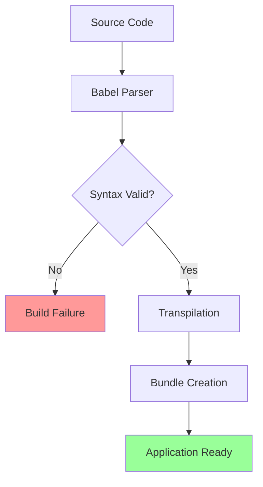

# Babel Parser Syntax Error Fix

## Overview

The Working-Workzzy React application is experiencing compilation failures due to Babel parser syntax errors in two critical files: `ConnectRefresh.js` and `ConnectReturn.js`. The error "Expecting Unicode escape sequence \uXXXX" occurs at line 1, column 44 in both files, specifically in the import statements where escaped quotes (`\"`) are present instead of proper quote characters (`"`).

This issue prevents the application from building and running, blocking development and deployment processes. The problem affects the Stripe Connect onboarding flow components, which are essential for the payment processing functionality.

## Problem Analysis

### Root Cause

The issue stems from incorrectly formatted string literals in import statements:

- Current (problematic): `import React, { useEffect, useState } from \"react\";`
- Expected (correct): `import React, { useEffect, useState } from "react";`

The backslash-escaped quotes (`\"`) are being interpreted by Babel as invalid Unicode escape sequences rather than string delimiters.

### Affected Components

1. **ConnectRefresh.js** - Handles Stripe Connect onboarding session refresh
2. **ConnectReturn.js** - Processes return flow from Stripe Connect onboarding

### Error Pattern

```
SyntaxError: Expecting Unicode escape sequence \uXXXX. (1:44)
> 1 | import React, { useEffect, useState } from \"react\";
    |                                             ^
```

## Architecture

### File Structure Impact

```
client/src/pages/
├── ConnectRefresh.js ❌ (syntax error)
├── ConnectReturn.js ❌ (syntax error)
└── [other components] ✅ (working)
```

### Build Process Flow



## Solution Design

### 1. Immediate Fix Strategy

Replace all escaped quotes with proper quote characters in import statements and string literals.

**Pattern Replacement:**

- Find: `\"`
- Replace: `"`

### 2. File-Specific Corrections

#### ConnectRefresh.js

**Line 1:** Fix import statement

```javascript
// Before (problematic)
import React, { useEffect, useState } from \"react\";

// After (corrected)
import React, { useEffect, useState } from "react";
```

**Lines 2-3:** Fix additional import statements

```javascript
// Before
import { useNavigate } from \"react-router-dom\";
import { connectApi } from \"../api/connectApi\";

// After
import { useNavigate } from "react-router-dom";
import { connectApi } from "../api/connectApi";
```

#### ConnectReturn.js

Apply identical corrections to import statements on lines 1-3.

### 3. Validation Process

#### Syntax Validation

- Ensure all string literals use consistent quote style
- Verify import statements follow standard ES6 syntax
- Validate JSX string props use proper quotes

#### Build Verification

1. Run `npm start` to test development build
2. Execute `npm run build` to verify production build
3. Check ESLint output for remaining syntax issues

### 4. Prevention Measures

#### Editor Configuration

Implement `.editorconfig` to prevent future occurrences:

```ini
root = true

[*.{js,jsx}]
charset = utf-8
end_of_line = lf
insert_final_newline = true
indent_style = space
indent_size = 2
```

#### ESLint Rules

Add quote consistency rules to `eslintConfig`:

```json
{
  "rules": {
    "quotes": ["error", "double", { "avoidEscape": true }]
  }
}
```

## Testing Strategy

### Unit Testing

- Verify component mounting without syntax errors
- Test import resolution for all dependencies
- Validate component functionality post-fix

### Integration Testing

- Test complete Stripe Connect onboarding flow
- Verify navigation between ConnectRefresh and ConnectReturn
- Validate API integration functionality

### Build Testing

```bash
# Clean build test
npm run build

# Development server test
npm start

# Lint validation
npm run lint
```

## Risk Assessment

### Low Risk

- Simple syntax correction with minimal code changes
- No logic or functionality modifications required
- Standard quote character replacement

### Mitigation Strategies

- Create backup of affected files before modification
- Test build process immediately after changes
- Verify component functionality in development environment

## Implementation Steps

1. **Backup Current Files**

   - Copy `ConnectRefresh.js` and `ConnectReturn.js` to backup location

2. **Apply Syntax Corrections**

   - Replace escaped quotes in import statements
   - Verify all string literals use consistent formatting

3. **Build Validation**

   - Run development build (`npm start`)
   - Execute production build (`npm run build`)
   - Check for additional syntax errors

4. **Functional Testing**

   - Test component rendering
   - Verify Stripe Connect integration
   - Validate navigation flow

5. **Code Quality Check**
   - Run ESLint validation
   - Verify code formatting consistency
   - Update documentation if needed
