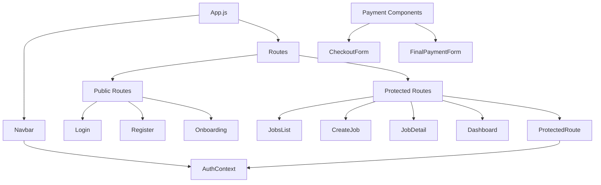
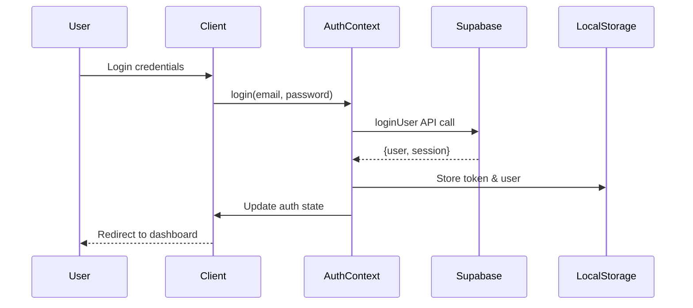
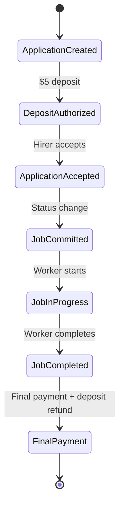
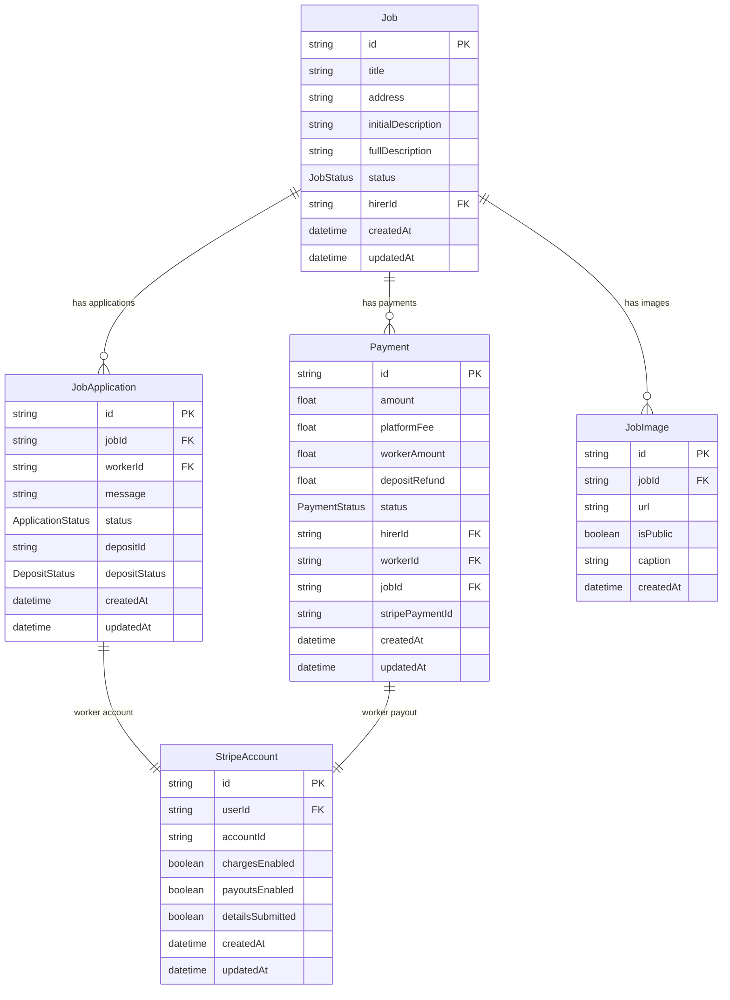
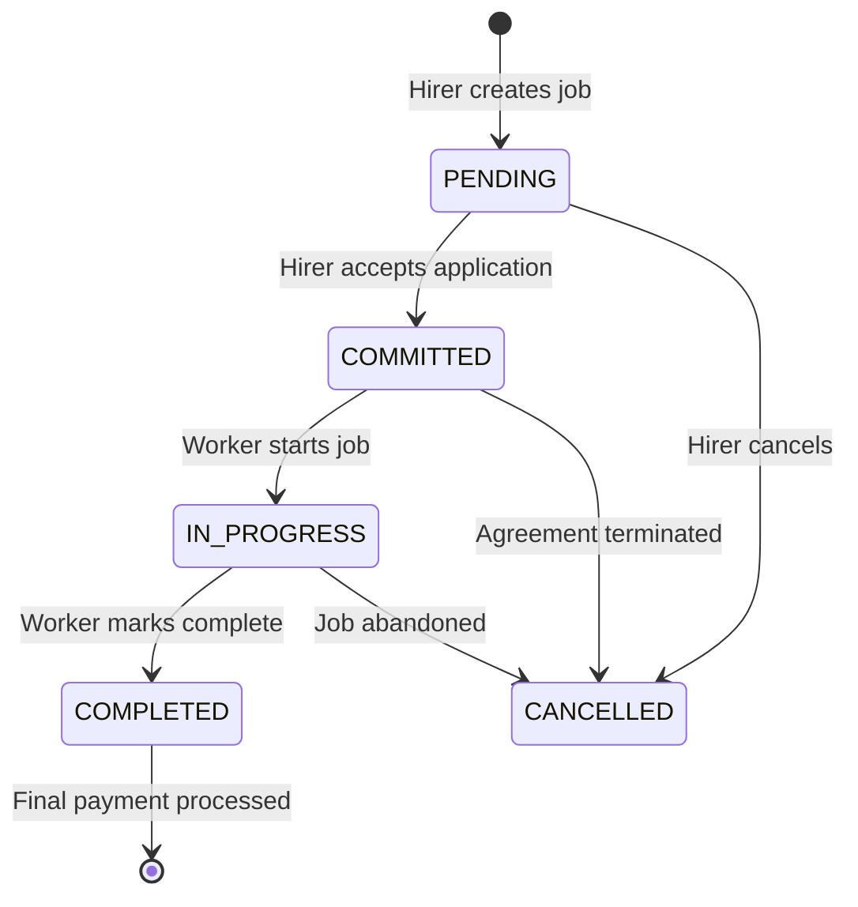

# Working-Workzzy Codebase Analysis

## Overview

Working-Workzzy is a full-stack web application that facilitates job posting, application management, and secure payment processing. The platform targets freelancers, hirers, and gig workers by providing a streamlined process for creating jobs, managing applications, establishing user connections, and handling secure payments via Stripe.

**Core Value Proposition:**

- Secure authentication and user onboarding
- Efficient job creation, discovery, and lifecycle management
- Application tracking and user connection system
- End-to-end payment processing with Stripe integration
- Role-based access control (Hirers vs Workers)

## Technology Stack & Dependencies

### Frontend Architecture

- **Framework:** React 19.1.1 with React Router DOM 7.8.1
- **Styling:** Tailwind CSS with PostCSS and Autoprefixer
- **HTTP Client:** Axios 1.11.0 for API communication
- **Payment Integration:** Stripe React (@stripe/react-stripe-js, @stripe/stripe-js)
- **Testing:** React Testing Library, Jest DOM
- **Build System:** React Scripts 5.0.1

### Backend Architecture

- **Runtime:** Node.js with Express 4.18.2
- **Database ORM:** Prisma 6.13.0 with PostgreSQL
- **Authentication:** Supabase Auth (@supabase/supabase-js)
- **Payment Processing:** Stripe 18.4.0 (server) / 13.0.0 (legacy)
- **Development:** Nodemon 3.0.2 for hot reloading
- **Middleware:** CORS, dotenv for environment management

### Data Layer

- **Database:** PostgreSQL with Prisma ORM
- **Authentication Provider:** Supabase
- **Payment Gateway:** Stripe Connect for multi-party payments
- **File Storage:** Assumed Supabase storage (inferred from architecture)

## Component Architecture

### Frontend Component Hierarchy



### Component Definitions

| Component            | Purpose                       | Props/State                | Key Features                                |
| -------------------- | ----------------------------- | -------------------------- | ------------------------------------------- |
| **App**              | Root component, routing setup | None                       | Route configuration, layout structure       |
| **Navbar**           | Navigation header             | `user`, `isAuthenticated`  | Role-based navigation, logout functionality |
| **ProtectedRoute**   | Route guard                   | `children`                 | Authentication verification                 |
| **AuthContext**      | Global auth state             | `user`, `token`, `loading` | Login/logout, token management              |
| **JobsList**         | Job discovery page            | Job data from API          | List all available jobs                     |
| **CreateJob**        | Job creation form             | Form data                  | Job posting for hirers                      |
| **JobDetail**        | Job details view              | `jobId` param              | Job info, applications, images              |
| **Dashboard**        | User dashboard                | User-specific data         | Role-based content display                  |
| **CheckoutForm**     | Payment interface             | Payment data               | Stripe payment integration                  |
| **FinalPaymentForm** | Final payment processing      | Job completion data        | Release payments to workers                 |

### Props/State Management Strategy

**Global State (AuthContext):**

- User authentication status
- User profile data
- JWT token management
- Authentication actions (login, register, logout)

**Component-Level State:**

- Form inputs and validation
- Loading states for API calls
- Local UI state (modals, dropdowns)

**API Integration Pattern:**

- Centralized API client with axios
- Dedicated API modules per domain (jobApi, authApi, paymentApi)
- Token-based authentication headers

## Routing & Navigation

### Route Structure

```mermaid
graph LR
    A[/] --> B[Public Routes]
    A --> C[Protected Routes]

    B --> D[/login]
    B --> E[/register]
    B --> F[/onboarding]

    C --> G[/ - JobsList]
    C --> H[/jobs/new - CreateJob]
    C --> I[/jobs/:id - JobDetail]
    C --> J[/dashboard - Dashboard]
```

### Navigation Logic

- **Public Access:** Login, Register, Onboarding
- **Authenticated Access:** All job-related pages, dashboard
- **Role-Based Features:**
  - Hirers can post jobs (`/jobs/new`)
  - Workers can apply for jobs
  - Both roles access dashboard with different content

## State Management

### Authentication Flow



### Payment State Flow



## API Integration Layer

### API Client Architecture

**Base Configuration:**

```javascript
// apiClient.js - Centralized HTTP client
axios.create({
  baseURL: process.env.REACT_APP_API_URL,
  headers: { "Content-Type": "application/json" },
});
```

### API Modules Structure

| Module             | Endpoints             | Purpose                               |
| ------------------ | --------------------- | ------------------------------------- |
| **authApi**        | `/api/auth/*`         | Login, register, user management      |
| **jobApi**         | `/api/jobs/*`         | Job CRUD, status updates, hirer jobs  |
| **applicationApi** | `/api/applications/*` | Application management, accept/reject |
| **paymentApi**     | `/api/payments/*`     | Payment processing, final payments    |
| **connectApi**     | `/api/connect/*`      | Stripe Connect onboarding             |

### Backend API Architecture

```mermaid
graph TD
    A[Express Server] --> B[CORS Middleware]
    B --> C[JSON Parser]
    C --> D[Route Handlers]

    D --> E[/api/jobs]
    D --> F[/api/auth]
    D --> G[/api/payments]
    D --> H[/api/applications]
    D --> I[/api/connect]

    E --> J[jobController]
    F --> K[authController]
    G --> L[paymentController]
    H --> M[applicationController]
    I --> N[connectController]

    J --> O[(Prisma/PostgreSQL)]
    K --> P[Supabase Auth]
    L --> Q[Stripe API]
    M --> O
    N --> Q
```

## Data Models & ORM Mapping

### Database Schema Overview



### Enum Definitions

**JobStatus:** `PENDING → COMMITTED → IN_PROGRESS → COMPLETED | CANCELLED`

**ApplicationStatus:** `APPLIED → ACCEPTED | REJECTED | WITHDRAWN`

**PaymentStatus:** `PENDING → PAID | FAILED | REFUNDED`

**DepositStatus:** `AUTHORIZED → CAPTURED | REFUNDED`

## Business Logic Layer

### Job Lifecycle Management



### Application Processing Logic

**Worker Application Flow:**

1. Worker applies with $5 deposit (PaymentIntent created)
2. Deposit authorized but not captured
3. Hirer reviews applications
4. On acceptance: Deposit captured, job status → COMMITTED
5. On rejection: Deposit refunded

**Payment Processing Logic:**

1. Job completion triggers final payment flow
2. Platform fee (10%) deducted
3. Worker receives 90% + $5 deposit refund
4. Stripe Connect handles multi-party transfers

### Authentication & Authorization

**Authentication Strategy:**

- Supabase JWT tokens for session management
- Token stored in localStorage with auto-expiry
- API client headers updated on auth state changes

**Role-Based Access:**

- **Hirers:** Can create jobs, review applications, make payments
- **Workers:** Can apply for jobs, start/complete work, receive payments
- **Both:** Access dashboard with role-specific content

## Middleware & Interceptors

### Authentication Middleware

```javascript
// auth.js middleware - Token verification
// Validates Supabase JWT tokens
// Attaches user object to req.user
```

### API Request Interceptors

- Authorization header injection
- Request/response logging
- Error handling standardization

## Testing Strategy

### Frontend Testing

- **Unit Tests:** React Testing Library for components
- **Integration Tests:** User interaction flows
- **API Tests:** Mock API responses with axios

### Backend Testing

- **API Tests:** Route testing with supertest (inferred)
- **Database Tests:** Prisma client testing
- **Payment Tests:** Stripe webhook testing

### Testing Gaps Identified

- No explicit testing framework configured in backend
- Missing E2E testing setup
- No CI/CD pipeline configuration

## Architecture Strengths

1. **Clear Separation of Concerns:** Frontend/backend boundaries well-defined
2. **Modern Technology Stack:** Current versions of React, Express, Prisma
3. **Secure Payment Processing:** Proper Stripe Connect implementation
4. **Type-Safe Database:** Prisma schema with enums and relationships
5. **Scalable API Design:** RESTful endpoints with consistent error handling

## Architecture Limitations

1. **Testing Coverage:** Limited testing infrastructure
2. **Error Monitoring:** No centralized logging or monitoring
3. **Environment Management:** Basic dotenv setup
4. **Security Hardening:** Missing rate limiting, input validation
5. **Performance Optimization:** No caching layer or optimization strategies
6. **Deployment Strategy:** No containerization or deployment configuration

## Performance Considerations

**Current Performance Bottlenecks:**

- No database query optimization
- Lack of API response caching
- No image optimization for JobImages
- Synchronous payment processing

**Recommended Optimizations:**

- Implement Redis caching for frequently accessed data
- Add database indexing for search queries
- Implement lazy loading for job lists
- Add CDN for static assets
