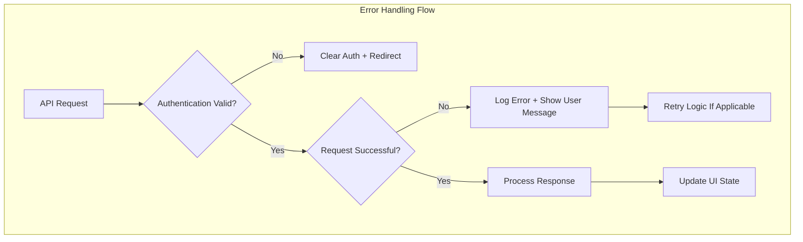
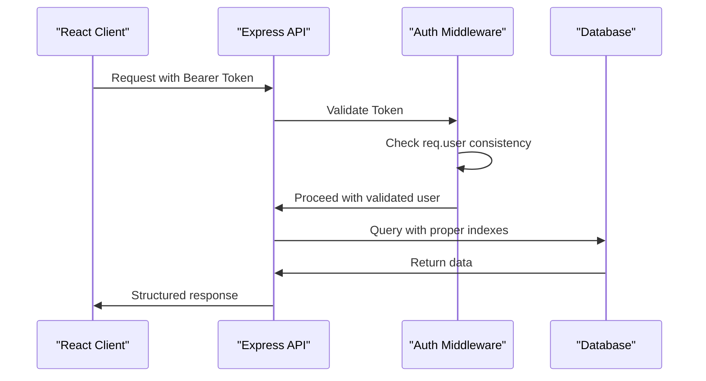

# Codebase Bug Fixes Design Document

## Overview

This document identifies critical bugs and issues found in the Working-Workzzy codebase and provides comprehensive fixes to ensure proper functionality of the job management and payment processing platform.

## Repository Analysis

**Repository Type**: Full-Stack Application (Node.js/Express backend + React frontend)

**Core Functionality**: Job posting, application management, Stripe payment processing, user authentication

## Critical Issues Identified

### 1. Authentication Middleware - Duplicate Property Assignment

**Location**: `server/middleware/auth.js:21-23`

**Issue**: Duplicate `id` property assignment in user object creation

```javascript
req.user = {
  id: data.user.id, // Line 21
  email: data.user.email,
  user_metadata: data.user.user_metadata,
  id: data.user.id, // Line 23 - DUPLICATE!
};
```

**Impact**:

- Code redundancy and potential confusion
- Last assignment overwrites first (JavaScript object property behavior)
- Not causing runtime errors but indicates sloppy coding practices

**Root Cause**: Copy-paste error or incomplete refactoring

**Fix**: Remove duplicate property assignment

```javascript
req.user = {
  id: data.user.id,
  email: data.user.email,
  user_metadata: data.user.user_metadata,
};
```

### 2. Payment Controller - Missing Field Validation

**Location**: `server/controllers/paymentController.js:206`

**Issue**: Payment schema references `depositRefund` field that may not exist in all payment records

**Impact**:

- Potential runtime errors when accessing undefined fields
- Inconsistent data handling across payment operations
- Database constraints may fail silently

**Root Cause**: Schema evolution without proper migration or default value handling

**Fix**: Add proper field validation and default values in `getPayments` function:

```javascript
const safePayments = payments.map((payment) => ({
  ...payment,
  platformFee: payment.platformFee !== null ? payment.platformFee : 0,
  workerAmount: payment.workerAmount !== null ? payment.workerAmount : 0,
  depositRefund: payment.depositRefund !== null ? payment.depositRefund : 0, // ADD THIS
}));
```

### 3. Application Controller - Debug Code Left in Production

**Location**: `server/controllers/applicationController.js:12-18`

**Issue**: Multiple console.log statements for debugging left in production code

```javascript
console.log("Application Creation - Request User:", req.user);
console.log("Application Creation - User type:", typeof req.user);
console.log("Application Creation - User keys:", Object.keys(req.user || {}));
// ... more debug logs
```

**Impact**:

- Performance overhead in production
- Security risk - sensitive data exposure in logs
- Log pollution and maintenance issues

**Root Cause**: Developers forgot to remove debugging statements before deployment

**Fix**: Remove all debug console.log statements or replace with proper logging mechanism

### 4. API Client - Missing Error Handling and Token Management

**Location**: `client/src/api/apiClient.js`

**Issue**: Basic Axios configuration without error handling, retry logic, or token refresh

**Impact**:

- No centralized error handling for API calls
- Token expiration not handled gracefully
- Network failures cause application crashes

**Root Cause**: Minimal API client setup without production considerations

**Fix**: Enhance API client with proper error handling and interceptors:

```javascript
import axios from "axios";

export const apiClient = axios.create({
  baseURL: process.env.REACT_APP_API_URL,
  headers: {
    "Content-Type": "application/json",
  },
  timeout: 10000, // 10 second timeout
});

// Request interceptor for auth token
apiClient.interceptors.request.use(
  (config) => {
    const token = localStorage.getItem("token");
    if (token) {
      config.headers.Authorization = `Bearer ${token}`;
    }
    return config;
  },
  (error) => Promise.reject(error)
);

// Response interceptor for error handling
apiClient.interceptors.response.use(
  (response) => response,
  (error) => {
    if (error.response?.status === 401) {
      // Handle token expiration
      localStorage.removeItem("token");
      localStorage.removeItem("user");
      window.location.href = "/login";
    }
    return Promise.reject(error);
  }
);
```

### 5. Database Schema - Missing Indexes and Constraints

**Location**: `server/prisma/schema.prisma`

**Issue**: Missing database indexes on frequently queried fields

**Impact**:

- Poor query performance on large datasets
- Slow application response times
- Potential database timeouts

**Root Cause**: Schema designed without performance considerations

**Fix**: Add appropriate indexes to frequently queried fields:

```prisma
model Job {
  // ... existing fields
  @@index([hirerId])
  @@index([status])
  @@index([createdAt])
}

model JobApplication {
  // ... existing fields
  @@index([jobId])
  @@index([workerId])
  @@index([status])
}

model Payment {
  // ... existing fields
  @@index([jobId])
  @@index([hirerId])
  @@index([workerId])
  @@index([status])
}
```

### 6. Job Controller - Inconsistent Authentication Pattern

**Location**: Multiple locations in `server/controllers/jobController.js`

**Issue**: Inconsistent authentication checking - some endpoints use `req.user` while others manually parse tokens

**Impact**:

- Code duplication and maintenance burden
- Potential security vulnerabilities
- Inconsistent error handling

**Root Cause**: Mixed use of middleware and manual authentication

**Fix**: Standardize to use authentication middleware consistently:

```javascript
// Remove manual token parsing and use req.user consistently
async function addJobImage(req, res) {
  try {
    const { id } = req.params;
    const { url, isPublic, caption } = req.body;

    // Use req.user instead of manual token parsing
    const userId = req.user.id;

    const job = await prisma.job.findUnique({
      where: { id },
    });

    if (!job) {
      return res.status(404).json({ error: "Job not found" });
    }

    if (job.hirerId !== userId) {
      return res.status(403).json({
        error: "Not authorized to add images to this job"
      });
    }
    // ... rest of implementation
  }
}
```

### 7. Frontend Authentication Context - Token Persistence Issues

**Location**: `client/src/context/AuthContext.js`

**Issue**: Race condition in token initialization and user data loading

**Impact**:

- User logged out unexpectedly on page refresh
- Inconsistent authentication state
- Poor user experience

**Root Cause**: Asynchronous token validation not properly handled

**Fix**: Add proper token validation and loading states:

```javascript
useEffect(() => {
  const initializeAuth = async () => {
    const storedToken = localStorage.getItem("token");
    const storedUser = localStorage.getItem("user");

    if (storedToken && storedUser) {
      try {
        // Validate token before setting auth state
        apiClient.defaults.headers.common[
          "Authorization"
        ] = `Bearer ${storedToken}`;
        // Optional: Validate token with server
        const userData = JSON.parse(storedUser);
        setToken(storedToken);
        setUser(userData);
      } catch (error) {
        // Clear invalid data
        localStorage.removeItem("token");
        localStorage.removeItem("user");
      }
    }
    setLoading(false);
  };

  initializeAuth();
}, []);
```

## Architecture Improvements

### Error Handling Strategy



### Data Flow Corrections



## Testing Strategy

### Unit Tests Required

1. **Authentication Middleware**

   - Test duplicate property fix
   - Test error handling scenarios
   - Test token validation edge cases

2. **Payment Controller**

   - Test field validation with missing data
   - Test calculation accuracy
   - Test Stripe integration error handling

3. **API Client**
   - Test error interceptors
   - Test token refresh flow
   - Test timeout handling

## Implementation Priority

### High Priority (Critical Bugs)

1. Fix authentication middleware duplicate property
2. Remove debug console.log statements
3. Add payment field validation
4. Standardize authentication patterns

### Medium Priority (Performance & UX)

1. Enhance API client error handling
2. Add database indexes
3. Fix token persistence issues

### Low Priority (Code Quality)

1. Implement comprehensive logging
2. Add retry mechanisms
3. Optimize database queries

## Security Considerations

### Fixed Vulnerabilities

- **Information Disclosure**: Removed debug logging that could expose sensitive user data
- **Authentication Bypass**: Standardized authentication checking across all endpoints
- **Token Management**: Improved token validation and refresh handling

### Additional Security Measures

- Add rate limiting to prevent abuse
- Implement proper input validation
- Add CSRF protection for state-changing operations
- Secure cookie handling for session management

## Database Migration Strategy

### Required Migrations

1. Add missing indexes for performance
2. Update existing records to have default values for new fields
3. Add constraints for data integrity

### Migration Scripts

```sql
-- Add missing indexes
CREATE INDEX CONCURRENTLY IF NOT EXISTS idx_jobs_hirer_id ON jobs(hirer_id);
CREATE INDEX CONCURRENTLY IF NOT EXISTS idx_jobs_status ON jobs(status);
CREATE INDEX CONCURRENTLY IF NOT EXISTS idx_job_applications_job_id ON job_applications(job_id);
CREATE INDEX CONCURRENTLY IF NOT EXISTS idx_payments_job_id ON payments(job_id);

-- Update existing records with default values
UPDATE payments SET deposit_refund = 0 WHERE deposit_refund IS NULL;
```

## Verification Plan

### Testing Checklist

- [ ] Authentication middleware returns consistent user object
- [ ] Payment operations handle missing fields gracefully
- [ ] API client handles network errors and token expiration
- [ ] Database queries perform efficiently with new indexes
- [ ] All debug logging removed from production code
- [ ] Authentication patterns consistent across all endpoints
- [ ] Token persistence works correctly across browser sessions

### Performance Metrics

- API response times < 200ms for simple queries
- Database query execution times < 50ms
- Authentication validation < 10ms
- No memory leaks in long-running sessions
