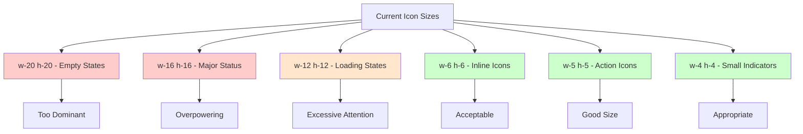
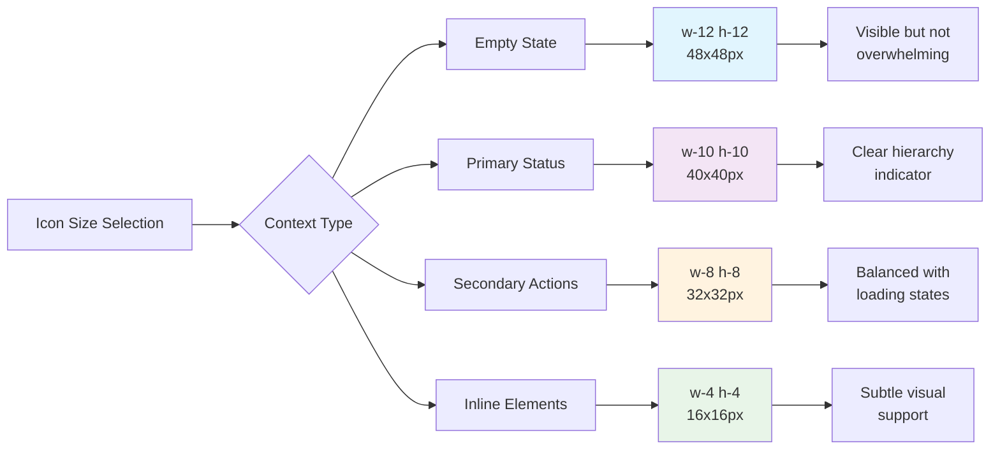
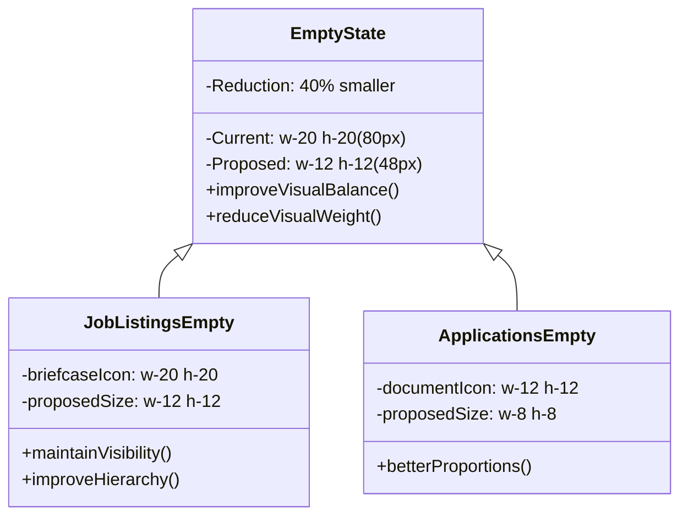
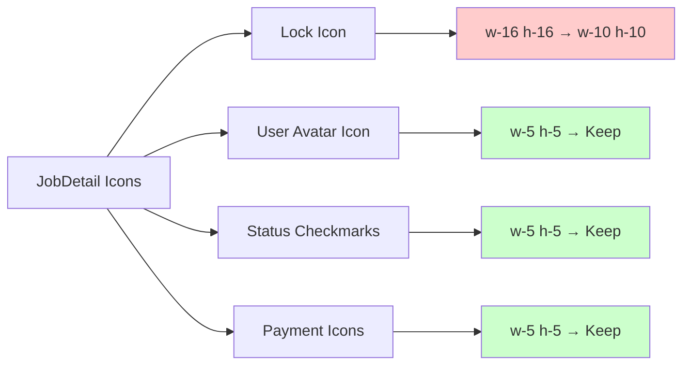
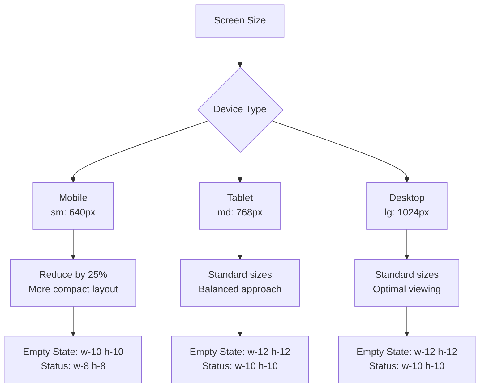
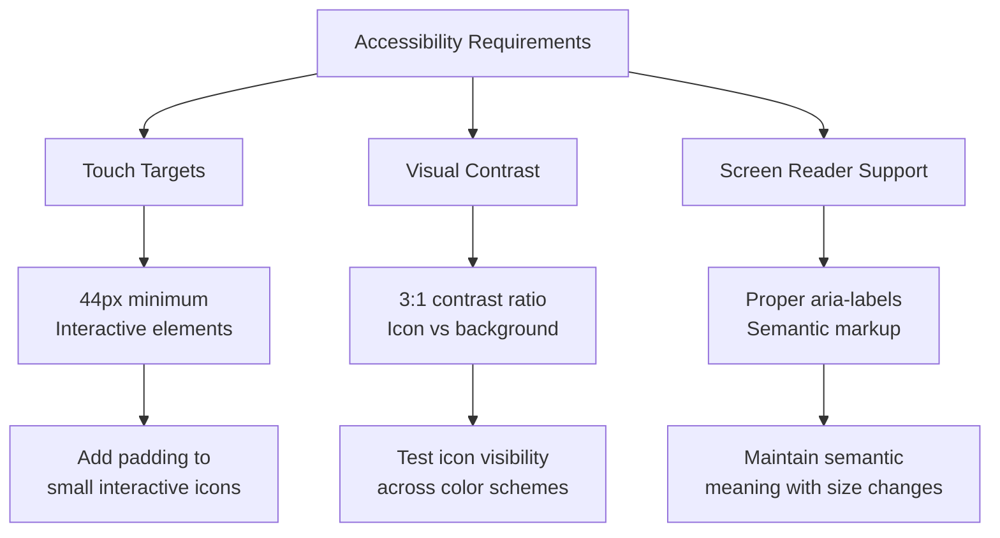

# Icon Size Reduction Design Document

## Overview

The Working-Workzzy application currently has oversized icons throughout the user interface, particularly affecting user experience and visual hierarchy. This design addresses the systematic reduction of icon sizes to create a more balanced and professional interface.

## Current Icon Size Issues

### Identified Oversized Icons

| Component          | Current Size | Location                              | Icon Type            |
| ------------------ | ------------ | ------------------------------------- | -------------------- |
| Empty State Icons  | `w-20 h-20`  | Dashboard job listings                | Briefcase icon       |
| Status Icons       | `w-16 h-16`  | JobDetail applications closed         | Lock icon            |
| Loading Indicators | `h-12 w-12`  | ConnectRefresh/ConnectReturn          | Spinner/Status icons |
| Application Icons  | `w-12 h-12`  | Dashboard empty applications          | Document icon        |
| Functional Icons   | `w-6 h-6`    | Various buttons and status indicators | Multiple types       |

### Visual Impact Analysis

## Icon Size Standards

### Proposed Size Hierarchy

| Context            | Current     | Proposed    | Tailwind Classes | Usage                           |
| ------------------ | ----------- | ----------- | ---------------- | ------------------------------- |
| Empty State Icons  | `w-20 h-20` | `w-12 h-12` | `w-12 h-12`      | Large placeholder illustrations |
| Major Status Icons | `w-16 h-16` | `w-10 h-10` | `w-10 h-10`      | Primary status indicators       |
| Loading Indicators | `w-12 h-12` | `w-8 h-8`   | `w-8 h-8`        | Progress indicators             |
| Section Headers    | `w-6 h-6`   | `w-5 h-5`   | `w-5 h-5`        | Section identifiers             |
| Inline Actions     | `w-5 h-5`   | `w-4 h-4`   | `w-4 h-4`        | Button icons                    |
| Small Indicators   | `w-4 h-4`   | `w-4 h-4`   | `w-4 h-4`        | Status badges, location pins    |

### Size Justification

## Component-Specific Changes

### Dashboard Component Icons

#### Empty State Improvements

#### Status Icon Updates

- **Location Icons**: `w-4 h-4` → Keep current size (appropriate)
- **Application Status Icons**: `w-6 h-6` → `w-5 h-5`
- **Job Progress Icons**: `w-6 h-6` → `w-5 h-5`

### JobDetail Component Icons

#### Application Status Indicators

### Connect Flow Icons

#### Status and Loading Indicators

- **Spinner**: `h-12 w-12` → `w-8 h-8`
- **Success Icons**: `w-6 h-6` → Keep current size
- **Warning Icons**: `w-6 h-6` → Keep current size
- **Error Icons**: `w-6 h-6` → Keep current size

## Implementation Strategy

### Phase 1: Critical Size Reductions

Target the most oversized icons that significantly impact user experience:

1. **Empty State Icons** (`w-20 h-20` → `w-12 h-12`)

   - Dashboard job listings empty state
   - Dashboard applications empty state

2. **Major Status Icons** (`w-16 h-16` → `w-10 h-10`)

   - JobDetail applications closed lock icon

3. **Loading Indicators** (`w-12 h-12` → `w-8 h-8`)
   - ConnectRefresh spinner
   - ConnectReturn spinner

### Phase 2: Consistency Improvements

Standardize moderately sized icons:

1. **Section Header Icons** (`w-6 h-6` → `w-5 h-5`)

   - Job progress indicators
   - Application section headers

2. **Button Icons** (Various → `w-4 h-4`)
   - Action buttons throughout application
   - Navigation elements

### Phase 3: Visual Polish

Fine-tune remaining icons for optimal visual balance.

## Responsive Considerations

### Icon Scaling Strategy

### Responsive Icon Classes

| Base Size   | Mobile (sm:)      | Tablet (md:)      | Desktop (lg:)     |
| ----------- | ----------------- | ----------------- | ----------------- |
| `w-12 h-12` | `sm:w-10 sm:h-10` | `md:w-12 md:h-12` | `lg:w-12 lg:h-12` |
| `w-10 h-10` | `sm:w-8 sm:h-8`   | `md:w-10 md:h-10` | `lg:w-10 lg:h-10` |
| `w-8 h-8`   | `sm:w-6 sm:h-6`   | `md:w-8 md:h-8`   | `lg:w-8 lg:h-8`   |

## Accessibility Considerations

### Touch Target Guidelines

- **Minimum Touch Target**: 44px × 44px (iOS) / 48dp (Android)
- **Interactive Icons**: Maintain adequate padding around clickable icons
- **Icon + Text Combinations**: Ensure sufficient spacing for readability

### Visual Clarity Standards

## Testing Strategy

### Visual Regression Testing

1. **Before/After Screenshots**: Document current vs. proposed sizes
2. **Cross-Device Testing**: Verify icon clarity on different screen sizes
3. **User Experience Testing**: Gather feedback on visual hierarchy improvements

### Performance Impact

- **Bundle Size**: No impact (same SVG icons, different CSS classes)
- **Rendering Performance**: Potential minor improvement with smaller icon rendering
- **Layout Stability**: Ensure icon size changes don't cause layout shifts

## Quality Assurance Checklist

### Icon Size Validation

- [ ] Empty states use `w-12 h-12` consistently
- [ ] Major status indicators use `w-10 h-10`
- [ ] Loading spinners use `w-8 h-8`
- [ ] Section headers use `w-5 h-5`
- [ ] Inline actions use `w-4 h-4`

### User Experience Validation

- [ ] Icons maintain clear visual hierarchy
- [ ] Touch targets remain accessible (44px minimum)
- [ ] Icon meaning remains clear at reduced sizes
- [ ] Visual balance improved across all components

### Cross-Platform Testing

- [ ] Icons render correctly on mobile devices
- [ ] Desktop layout maintains professional appearance
- [ ] High-DPI displays show crisp icon rendering
- [ ] Dark mode compatibility maintained

## Expected Outcomes

### User Experience Improvements

1. **Better Visual Hierarchy**: Icons no longer dominate interface elements
2. **Professional Appearance**: More balanced and refined visual design
3. **Improved Readability**: Text content gets appropriate visual priority
4. **Enhanced Usability**: Clearer distinction between different interface elements

### Technical Benefits

1. **Consistent Design System**: Standardized icon sizing across application
2. **Maintainable CSS**: Clear size guidelines for future development
3. **Responsive Design**: Better adaptation across device sizes
4. **Accessibility Compliance**: Maintained touch targets and visual clarity
