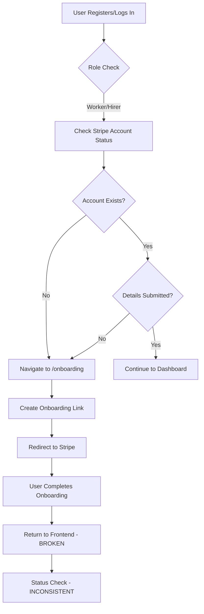
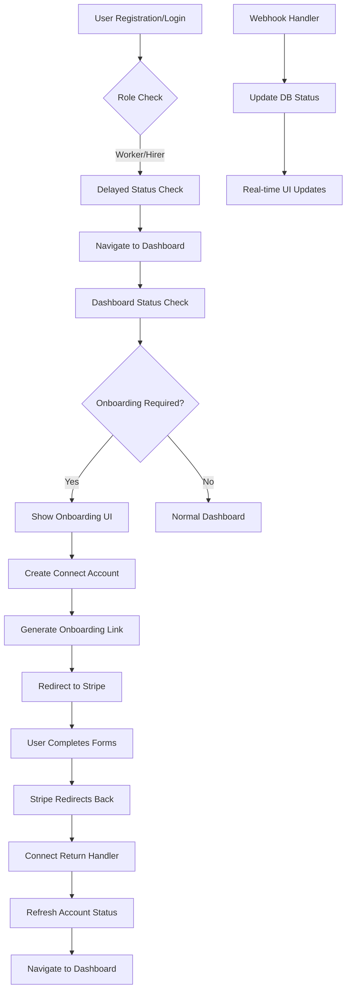
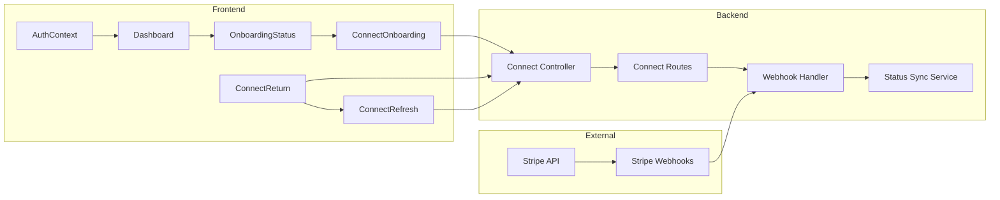
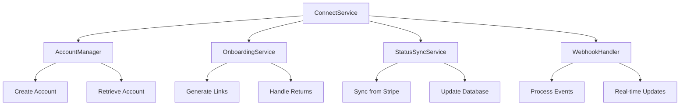
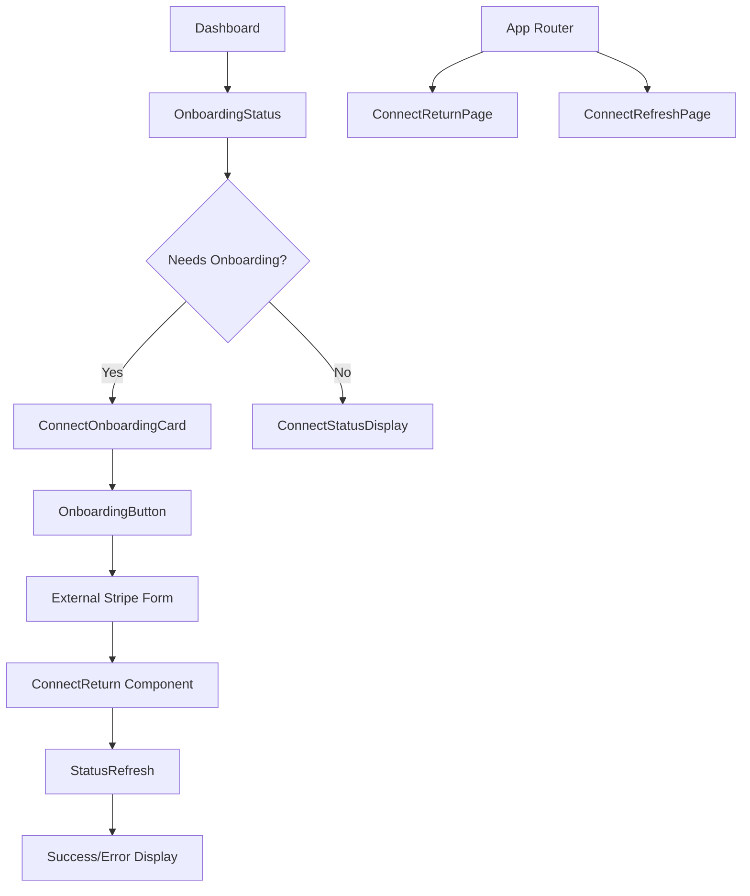
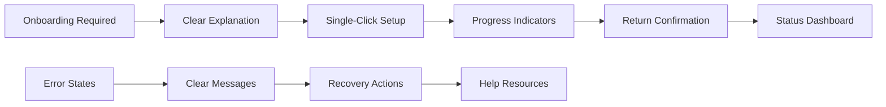

# Stripe Connect Onboarding Fix Design

## Overview

This design addresses critical issues in the Working-Workzzy Stripe Connect onboarding system. The current implementation has inconsistent API endpoints, missing route handlers, poor error handling, and incomplete account status synchronization. This fix will create a robust, user-friendly onboarding flow that properly handles all Stripe Connect scenarios.

## Current System Analysis

### Issues Identified

1. **Duplicate API Implementations**: Both `connectController.js` and `routes/connect.js` implement similar functionality with different response formats
2. **Missing Return Flow Routes**: Frontend lacks `/connect-return` and `/connect-refresh` route handlers
3. **Inconsistent Environment Variables**: Mixed usage of `CONNECT_REFRESH_URL`/`CONNECT_RETURN_URL` vs `FRONTEND_URL`
4. **Poor Status Synchronization**: No webhook handling for real-time account updates
5. **Inadequate Error Handling**: Limited user feedback for onboarding failures
6. **Auth Flow Issues**: Onboarding checks in AuthContext that can cause navigation errors

### Current Flow Problems



## Architecture

### Updated System Flow



### Component Architecture



## API Endpoints Reference

### Consolidated Connect API

| Method | Endpoint               | Purpose                                  | Response                                                     |
| ------ | ---------------------- | ---------------------------------------- | ------------------------------------------------------------ |
| `POST` | `/api/connect/account` | Create Connect account & onboarding link | `{accountId, onboardingUrl}`                                 |
| `GET`  | `/api/connect/status`  | Get current account status               | `{exists, chargesEnabled, payoutsEnabled, detailsSubmitted}` |
| `POST` | `/api/connect/refresh` | Refresh account status from Stripe       | `{updated: true, status: {...}}`                             |
| `POST` | `/api/webhooks/stripe` | Handle Stripe account updates            | `{received: true}`                                           |

### Request/Response Schema

```typescript
// POST /api/connect/account
interface CreateAccountRequest {
  // No body required - uses authenticated user
}

interface CreateAccountResponse {
  accountId: string;
  onboardingUrl: string;
  refreshUrl: string;
  returnUrl: string;
}

// GET /api/connect/status
interface StatusResponse {
  exists: boolean;
  accountId?: string;
  chargesEnabled: boolean;
  payoutsEnabled: boolean;
  detailsSubmitted: boolean;
  requiresAction?: boolean;
  actionUrl?: string;
}

// POST /api/connect/refresh
interface RefreshResponse {
  updated: boolean;
  status: StatusResponse;
  changes?: string[];
}
```

## Data Models & Database Updates

### Enhanced StripeAccount Model

```prisma
model StripeAccount {
  id                String   @id @default(cuid())
  userId            String   @unique @map("user_id")
  accountId         String   @unique @map("account_id")
  chargesEnabled    Boolean  @default(false) @map("charges_enabled")
  payoutsEnabled    Boolean  @default(false) @map("payouts_enabled")
  detailsSubmitted  Boolean  @default(false) @map("details_submitted")
  requiresAction    Boolean  @default(false) @map("requires_action")
  currentDeadline   DateTime? @map("current_deadline")
  lastSyncAt        DateTime? @map("last_sync_at")
  createdAt         DateTime @default(now())
  updatedAt         DateTime @updatedAt
  @@map("stripe_accounts")
}
```

### Migration Requirements

```sql
-- Add new columns to stripe_accounts table
ALTER TABLE "stripe_accounts"
ADD COLUMN "requires_action" BOOLEAN DEFAULT false,
ADD COLUMN "current_deadline" TIMESTAMP(3),
ADD COLUMN "last_sync_at" TIMESTAMP(3);

-- Add unique constraint on account_id
CREATE UNIQUE INDEX "stripe_accounts_account_id_key"
ON "stripe_accounts"("account_id");
```

## Business Logic Layer

### Connect Service Architecture



### Core Business Rules

1. **Account Creation**: One Stripe Connect account per user maximum
2. **Onboarding Links**: Fresh links generated for each onboarding attempt
3. **Status Synchronization**: Sync from Stripe every status check + webhook updates
4. **Error Recovery**: Clear guidance for incomplete onboarding scenarios
5. **Security**: All operations require authenticated user context

## Frontend Components

### Component Hierarchy



### State Management Strategy

```typescript
// Enhanced AuthContext
interface AuthContextValue {
  user: User | null;
  stripeStatus: StripeStatus | null;
  refreshStripeStatus: () => Promise<void>;
  initiateOnboarding: () => Promise<string>;
}

// Stripe Status Hook
interface UseStripeStatusReturn {
  status: StripeStatus | null;
  loading: boolean;
  error: string | null;
  refresh: () => Promise<void>;
  requiresOnboarding: boolean;
}
```

## Routing & Navigation

### Frontend Route Updates

```typescript
// New routes to add to App.js
<Route path="/connect-return" element={<ConnectReturn />} />
<Route path="/connect-refresh" element={<ConnectRefresh />} />
<Route path="/onboarding" element={<Onboarding />} />
<Route path="/onboarding/status" element={<OnboardingStatus />} />
```

### URL Flow Patterns

1. **Initial Onboarding**: `/onboarding` → Stripe → `/connect-return`
2. **Re-onboarding**: `/dashboard` → Stripe → `/connect-return`
3. **Refresh Flow**: Stripe → `/connect-refresh` → `/dashboard`
4. **Status Check**: Always available at `/onboarding/status`

## Error Handling & User Feedback

### Error Categories & Recovery

| Error Type                | Scenario                        | User Action               | Technical Action                          |
| ------------------------- | ------------------------------- | ------------------------- | ----------------------------------------- |
| **Incomplete Onboarding** | User exits Stripe form early    | "Complete Setup" button   | Refresh status, show current requirements |
| **Network Failure**       | API timeout during status check | "Try Again" button        | Retry with exponential backoff            |
| **Invalid Account**       | Stripe account suspended        | Contact support message   | Log for manual review                     |
| **Browser Issues**        | Popup blocked                   | Alternative redirect flow | Fallback to full-page redirect            |

### User Experience Enhancements



## Testing Strategy

### Unit Test Coverage

1. **Backend Services**

   - Account creation logic
   - Status synchronization
   - Webhook processing
   - Error handling scenarios

2. **Frontend Components**
   - Onboarding flow components
   - Status display accuracy
   - Error state rendering
   - Navigation handling

### Integration Test Scenarios

1. **Complete Onboarding Flow**

   - New user registration
   - Account creation
   - Stripe form completion
   - Return flow handling

2. **Error Recovery Flows**

   - Incomplete onboarding
   - Network failures
   - Invalid webhook data
   - Authentication issues

3. **Status Synchronization**
   - Webhook updates
   - Manual refresh
   - Concurrent user sessions
   - Database consistency

### Testing Tools & Approach

- **Unit Tests**: Jest for both frontend and backend
- **Integration Tests**: Cypress for full user flows
- **API Testing**: Postman collections for endpoint validation
- **Stripe Testing**: Test mode webhooks and accounts
