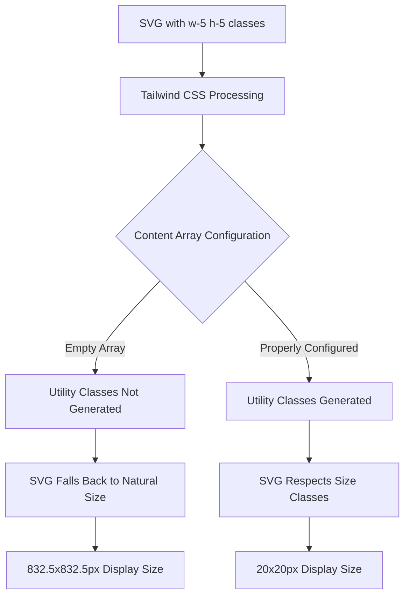
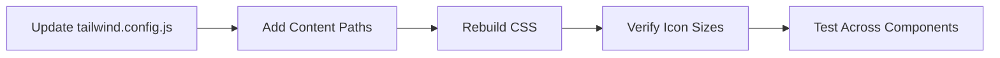
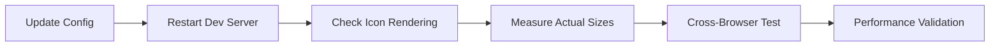

# SVG Icon Scaling Debug Design

## Overview

This design addresses the critical SVG icon scaling issue where icons with `w-5 h-5` Tailwind classes are rendering at massive sizes (832.5x832.5px) instead of the expected 20x20px. The root cause is a misconfigured Tailwind CSS setup that prevents utility classes from being properly generated.

## Problem Analysis

### Root Cause Identification



### Technical Investigation Results

**Current Configuration Issues:**
1. **Empty Content Array**: `tailwind.config.js` has `content: []` preventing class scanning
2. **Missing File Paths**: No source file paths specified for Tailwind to analyze
3. **Inconsistent Build Process**: Tailwind installed at root but classes used in client

**Evidence from Codebase:**
- Multiple SVG icons using `w-5 h-5` classes across `JobDetail.js`, `Dashboard.js`
- Tailwind utilities working via `@apply` directives in `App.css`
- PostCSS configured to process Tailwind but configuration incomplete

## Solution Architecture

### Configuration Fix Strategy



### Implementation Approach

**1. Tailwind Configuration Update**
```javascript
// tailwind.config.js
module.exports = {
  content: [
    "./client/src/**/*.{js,jsx,ts,tsx}",
    "./client/public/index.html",
  ],
  theme: {
    extend: {
      // Ensure standard sizing is available
      width: {
        '5': '1.25rem', // 20px
      },
      height: {
        '5': '1.25rem', // 20px
      }
    },
  },
  plugins: [],
}
```

**2. Icon Component Standardization**

Create a reusable icon component with consistent sizing:

```jsx
// IconWrapper Component
const IconWrapper = ({ 
  size = "w-5 h-5", 
  className = "", 
  children,
  ...props 
}) => {
  const baseClasses = `${size} ${className}`;
  
  return React.cloneElement(children, {
    className: baseClasses,
    ...props
  });
};
```

**3. SVG Attribute Enforcement**

Ensure SVG elements have proper attributes:
- `viewBox="0 0 24 24"` for consistent scaling
- `fill="none"` or appropriate fill
- `stroke="currentColor"` for theme compatibility

## Icon Sizing Standards

### Size Classification System

| Context | Tailwind Class | Pixel Size | Use Case |
|---------|---------------|------------|----------|
| Inline Indicators | `w-4 h-4` | 16px | Location, small status |
| Section Headers | `w-5 h-5` | 20px | Navigation, buttons |
| Loading Spinners | `w-6 h-6` or `w-8 h-8` | 24px or 32px | Progress indicators |
| Status Icons | `w-10 h-10` | 40px | Major status display |
| Empty State Icons | `w-12 h-12` | 48px | Placeholder graphics |

### Implementation Guidelines

**Consistent SVG Structure:**
```jsx
<svg 
  className="w-5 h-5 text-blue-600" 
  fill="none" 
  stroke="currentColor" 
  viewBox="0 0 24 24"
>
  <path strokeLinecap="round" strokeLinejoin="round" strokeWidth={2} d="..." />
</svg>
```

**Critical Attributes:**
- `viewBox="0 0 24 24"` - Defines coordinate system
- `fill="none"` - Prevents unwanted fills
- `stroke="currentColor"` - Inherits text color
- `strokeWidth={2}` - Consistent line weight

## Testing Strategy

### Verification Checklist



**Size Verification Process:**
1. **Browser DevTools Inspection**
   - Check computed styles for `width` and `height`
   - Verify actual rendered dimensions
   - Confirm no inline styles override

2. **Component Testing**
   - Test icons in different contexts (buttons, headers, cards)
   - Verify responsive behavior
   - Check accessibility attributes

3. **Performance Impact**
   - Measure CSS bundle size after configuration
   - Verify no significant build time increase
   - Check for unused CSS purging

## Implementation Steps

### Phase 1: Configuration Fix
1. Update `tailwind.config.js` with proper content paths
2. Restart development server
3. Verify Tailwind classes are generated

### Phase 2: Icon Audit
1. Identify all SVG icons using size classes
2. Standardize `viewBox` and other attributes
3. Test each icon for proper sizing

### Phase 3: Component Standardization
1. Create reusable icon wrapper component
2. Update existing icon implementations
3. Establish icon usage guidelines

### Phase 4: Validation
1. Cross-browser testing (Chrome, Firefox, Safari, Edge)
2. Mobile responsiveness verification
3. Accessibility compliance check

## Risk Mitigation

### Potential Issues and Solutions

**Build Process Conflicts:**
- **Risk**: Changes may affect other Tailwind usage
- **Mitigation**: Test all components using Tailwind utilities

**Browser Compatibility:**
- **Risk**: SVG rendering differences across browsers
- **Mitigation**: Include fallback styles and thorough testing

**Performance Impact:**
- **Risk**: Larger CSS bundle with more utilities
- **Mitigation**: Proper purging configuration in production

## Success Metrics

### Validation Criteria

**Functional Requirements:**
- All icons with `w-5 h-5` render at exactly 20x20px
- No visual regression in existing components
- Consistent icon spacing and alignment

**Technical Requirements:**
- CSS bundle size increase < 10%
- Build time impact < 5%
- Zero console errors related to styling

**User Experience:**
- Icons maintain visual hierarchy
- Responsive behavior preserved
- Accessibility standards maintained